Assignment link: https://github.com/hantswilliams/HHA-504-2025/blob/main/assignment_4/database_deployment.md


### Videos
Managed DB: https://youtu.be/LJhiQ5PFzwU 


VM: https://www.youtube.com/watch?v=g5sBPRp9DPY

Managed service names by cloud
- GCP: Cloud SQL for MySQL

VM services by cloud
- GCP: Compute Engine


## Cloud selected: GCP
#### Region: US-East1 (SC) 
##### VM specs: 
Machine Type: E2 Series
Size : e2-Small shared Core - 2 GB memory
Operating System: Ubuntu - Version: 25.10 minimal  10 GB size
For networking : Allow all HTTP and HTTPS
##### Firewall additional add-on
name : mysql
targets: specified 
target tag: all instances
source: 0.0.0.0./0
enable tcp 3306


-----

##### virtualmachine.py
```bash
scripts/virtualmachine.py
```

##### managed_service.py
```bash
scripts/managed_service.py
```


### Steps used for connection in cloud shell 

Update ubuntu 
```bash
sudo apt-get update
```

To install nano
```Bash 
sudo apt install nano
```

To install mysql
```bash
sudo apt install mysql-server mysql-client #-y 
# (if you add this arguement it autosays yes which is optional)
```

To connect to sql database 
```bash
sudo mysql
```

To connect to another database seen in managed database
```bash
mysql -u #username -h #ipaddressnumbers -p
```

note: u stands for user, h stands for host
##### Exit out of SHH then back in SHH
```bash
sudo mysql
```


### Screenshot and summaries 
please see code for quick descriptions of each screenshot


##### Managed Screenshots

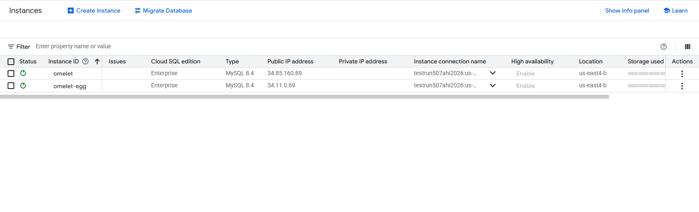  

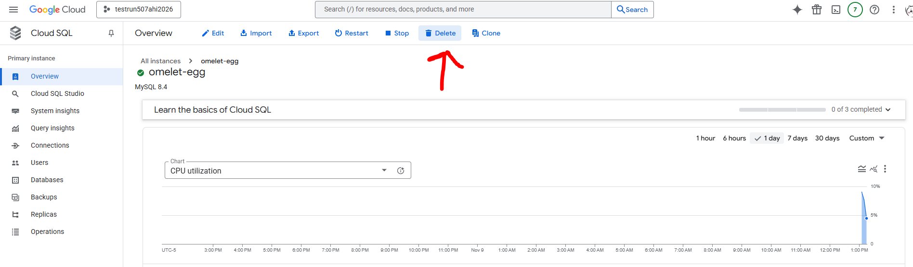
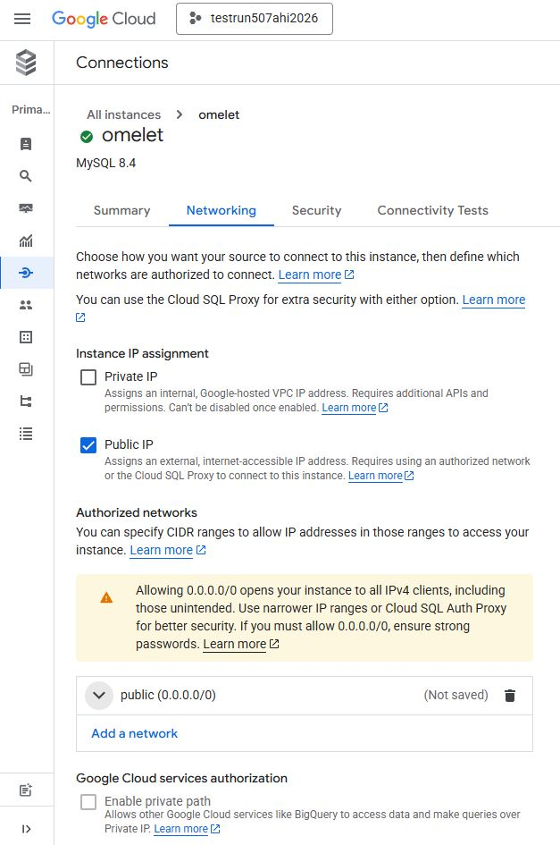
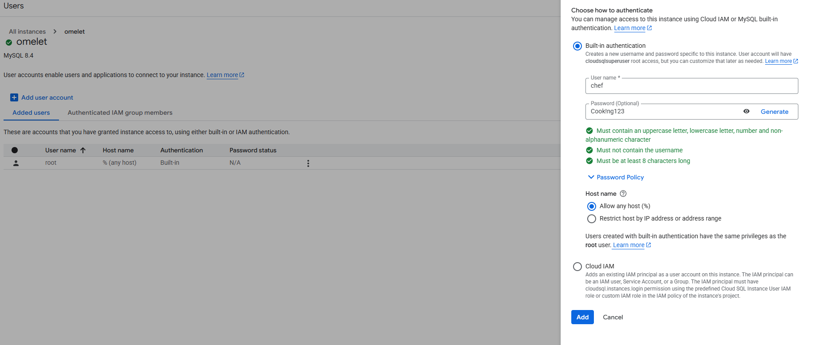
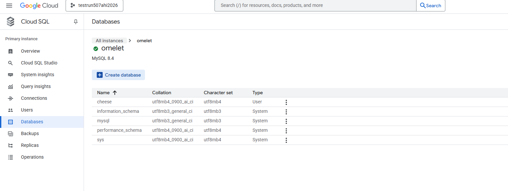
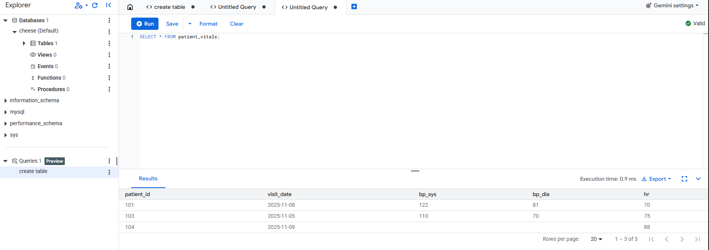
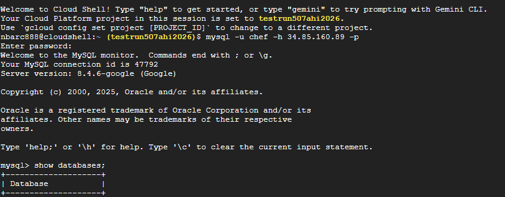
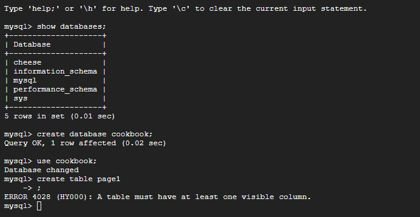


##### VM Screenshots 

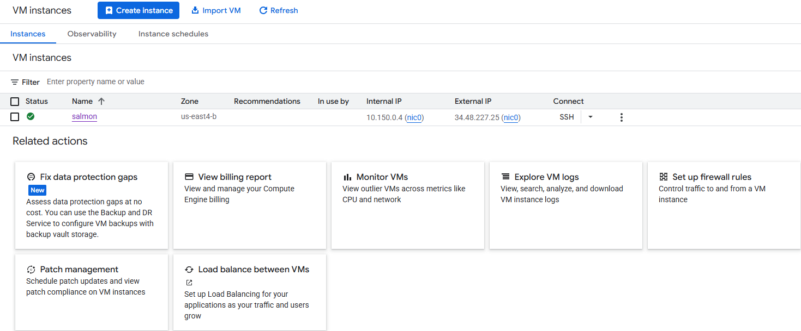
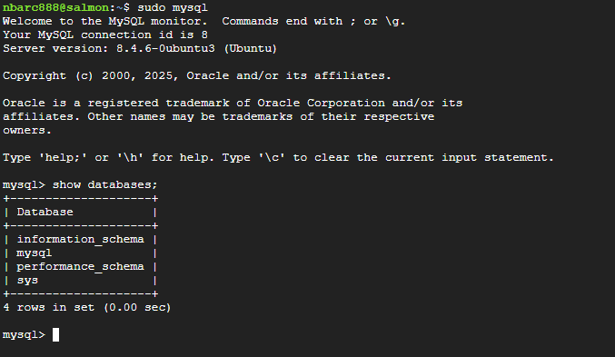


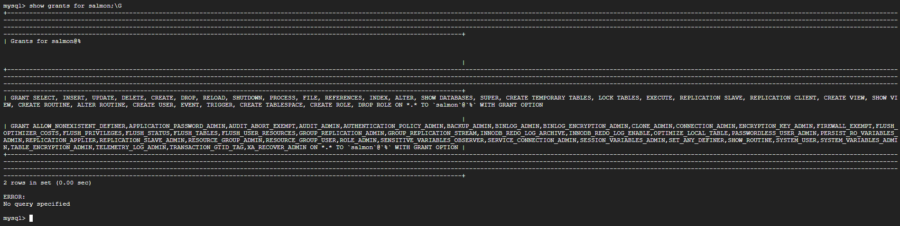
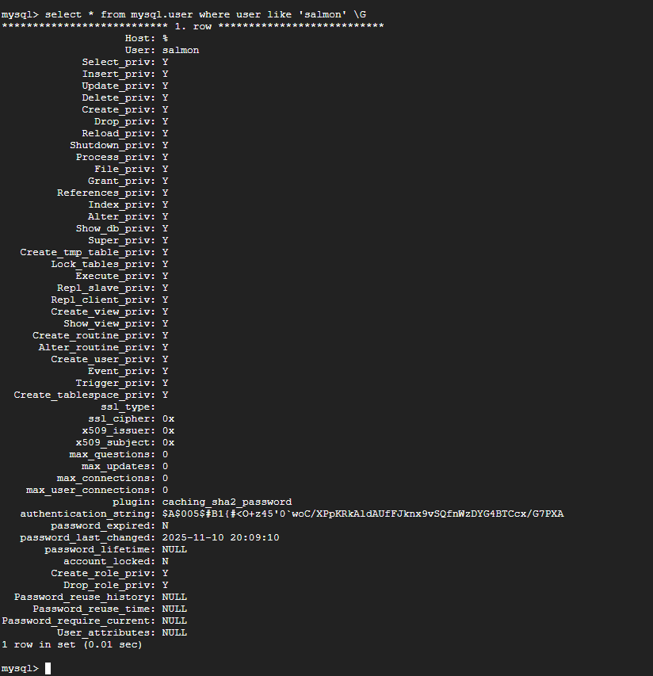
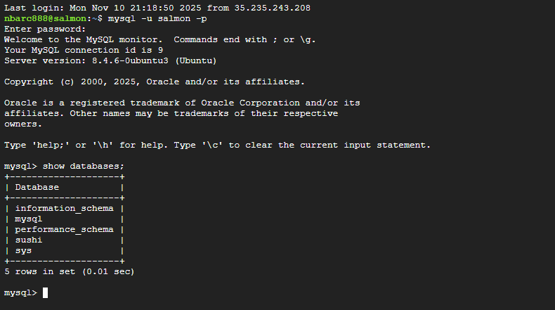

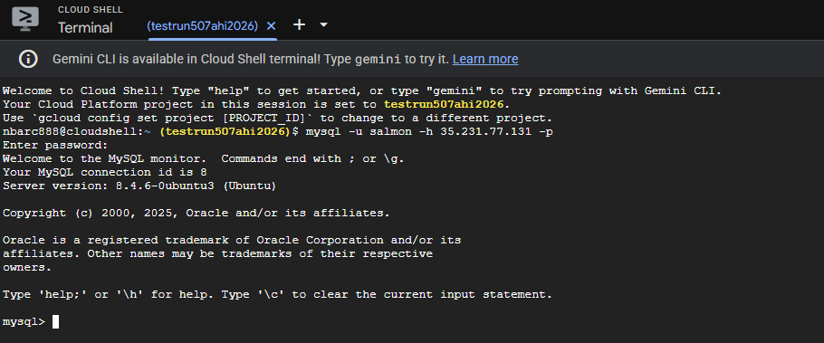
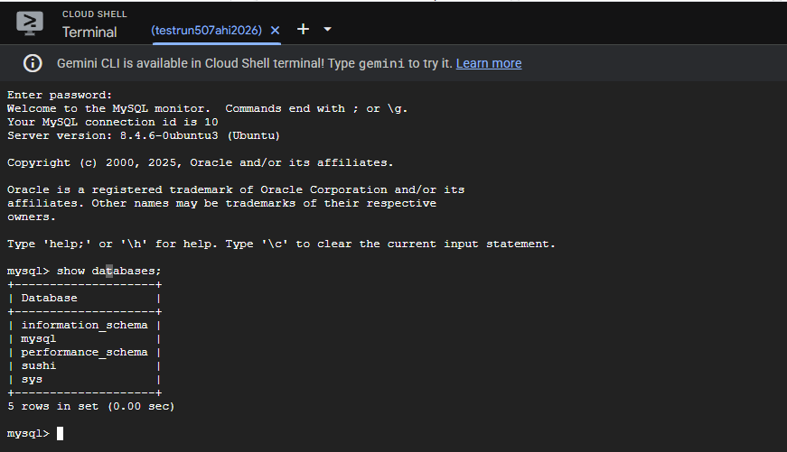


